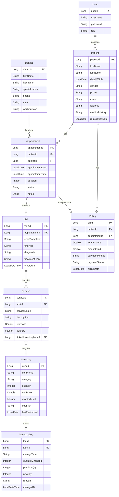

# MIE350_DentalCilinic_WebApplication
MIE350 team
<<<<<<< HEAD
<<<<<<< HEAD

## 1. Data Schema (Table Structure)

| Table | Description |
|------|------|
| `users` | System users (for login) |
| `patient` | Patients |
| `dentist` | Dentists |
| `appointment` | Appointments |
| `visit` | Visit records |
| `clinic_service` | Clinical service items (services under each visit) |
| `billing` | Bills |
| `inventory` | Inventory items |
| `inventory_log` | Inventory change logs |

### 1.1 users
| Column | Type | Description |
|------|------|------|
| user_id | Long (PK) | Primary key |
| username | String | Username, unique |
| password | String | Password |
| role | String | Role: receptionist, dentist, admin |

### 1.2 patient
| Column | Type | Description |
|------|------|------|
| patient_id | Long (PK) | Primary key |
| first_name | String | First name |
| last_name | String | Last name |
| date_of_birth | LocalDate | Date of birth |
| gender | String | Gender |
| phone | String | Phone |
| email | String | Email |
| address | String | Address |
| medical_history | String | Medical history |
| registration_date | LocalDate | Registration date |

### 1.3 dentist
| Column | Type | Description |
|------|------|------|
| dentist_id | Long (PK) | Primary key |
| first_name | String | First name |
| last_name | String | Last name |
| specialization | String | Specialization |
| phone | String | Phone |
| email | String | Email |
| working_days | String | Working days, comma-separated, e.g. "Monday,Tuesday,Wednesday" |

### 1.4 appointment
| Column | Type | Description |
|------|------|------|
| appointment_id | Long (PK) | Primary key |
| patient_id | Long (FK) | Patient ID |
| dentist_id | Long (FK) | Dentist ID |
| appointment_date | LocalDate | Appointment date |
| appointment_time | LocalTime | Appointment time |
| duration | Integer | Duration (minutes) |
| status | String | Scheduled, InProgress, Completed, Cancelled |
| notes | String | Notes |

### 1.5 visit
| Column | Type | Description |
|------|------|------|
| visit_id | Long (PK) | Primary key |
| appointment_id | Long (FK) | Appointment ID |
| chief_complaint | String | Chief complaint |
| findings | String | Findings |
| diagnosis | String | Diagnosis |
| treatment_plan | String | Treatment plan |
| created_at | LocalDateTime | Created at |

### 1.6 clinic_service
| Column | Type | Description |
|------|------|------|
| service_id | Long (PK) | Primary key |
| visit_id | Long (FK) | Visit ID |
| service_name | String | Service name |
| description | String | Description |
| unit_cost | Double | Unit cost |
| quantity | Integer | Quantity |
| linked_inventory_item_id | Long | Linked inventory ID (optional) |

### 1.7 billing
| Column | Type | Description |
|------|------|------|
| bill_id | Long (PK) | Primary key |
| patient_id | Long (FK) | Patient ID |
| appointment_id | Long | Appointment ID (nullable) |
| total_amount | Double | Total amount |
| amount_paid | Double | Amount paid |
| payment_method | String | Payment method |
| payment_status | String | Paid, Pending, Overdue |
| billing_date | LocalDate | Billing date |

### 1.8 inventory
| Column | Type | Description |
|------|------|------|
| item_id | Long (PK) | Primary key |
| item_name | String | Item name |
| category | String | Category |
| quantity | Integer | Quantity |
| unit_price | Double | Unit price |
| reorder_level | Integer | Reorder threshold |
| supplier | String | Supplier |
| last_restocked | LocalDate | Last restocked date |

### 1.9 inventory_log
| Column | Type | Description |
|------|------|------|
| log_id | Long (PK) | Primary key |
| item_id | Long (FK) | Inventory ID |
| change_type | String | Restock, Consume, Auto-Deducted by Visit |
| quantity_changed | Integer | Quantity changed |
| previous_qty | Integer | Quantity before change |
| new_qty | Integer | Quantity after change |
| reason | String | Reason |
| changed_at | LocalDateTime | Changed at |

---

## 2. Entity Relationship Diagram (UML)

---

## 3. Model / Entity Overview

| Java Class | Table | Description |
|---------|------|------|
| User | users | System user |
| Patient | patient | Patient |
| Dentist | dentist | Dentist |
| Appointment | appointment | Appointment (includes patient, dentist relations) |
| Visit | visit | Visit record |
| Service | clinic_service | Clinical service item |
| Billing | billing | Bill |
| Inventory | inventory | Inventory |
| InventoryLog | inventory_log | Inventory log |

---

## 4. Repository Overview

| Repository | Entity | Key Methods |
|------------|------|----------|
| UserRepository | User | findByUsernameAndPassword |
| PatientRepository | Patient | findByFirstNameContainingIgnoreCaseOrLastNameContainingIgnoreCase |
| DentistRepository | Dentist | Standard CRUD |
| AppointmentRepository | Appointment | findByPatientId, findByDentistId, findByDentistIdAndAppointmentDate, findByAppointmentDate |
| VisitRepository | Visit | findByAppointmentId |
| ServiceRepository | Service | findByVisitId |
| BillingRepository | Billing | findByPatientId, findByPaymentStatus, sumRevenueByDateRange |
| InventoryRepository | Inventory | findLowStock, countLowStock |
| InventoryLogRepository | InventoryLog | findByItemIdOrderByChangedAtDesc, findByChangedAtBetweenOrderByChangedAtDesc |

---

## 5. Service Overview

| Service | Responsibility |
|---------|------|
| PatientService | Patient CRUD, search by name |
| DentistService | Dentist CRUD, find available dentists by date |
| AppointmentService | Appointment CRUD, conflict detection |
| VisitService | Visit CRUD |
| ServiceService | Clinical service CRUD, calculate visit total |
| BillingService | Billing CRUD, overdue query |
| InventoryService | Inventory CRUD, restock, consume, history |
| DashboardService | Dashboard statistics |

---

## 6. API Endpoints Summary

### 6.1 Authentication
| Method | Path | Description |
|------|------|------|
| POST | /api/auth/login | Login. Body: `{"username":"xxx","password":"xxx"}`. Success returns `{userId, username, role}` |

### 6.2 Patients
| Method | Path | Description |
|------|------|------|
| GET | /api/patients | Get all patients |
| GET | /api/patients/{id} | Get by ID |
| GET | /api/patients/search?name=xxx | Search by name |
| POST | /api/patients | Create patient |
| PUT | /api/patients/{id} | Update patient |
| DELETE | /api/patients/{id} | Delete patient |

### 6.3 Dentists
| Method | Path | Description |
|------|------|------|
| GET | /api/dentists | Get all dentists |
| GET | /api/dentists/{id} | Get by ID |
| GET | /api/dentists/available?date=yyyy-MM-dd | Dentists available on date |
| POST | /api/dentists | Create dentist |
| PUT | /api/dentists/{id} | Update dentist |
| DELETE | /api/dentists/{id} | Delete dentist |

### 6.4 Appointments
| Method | Path | Description |
|------|------|------|
| GET | /api/appointments | Get all appointments |
| GET | /api/appointments/{id} | Get by ID |
| GET | /api/appointments/patient/{patientId} | Get by patient |
| GET | /api/appointments/dentist/{dentistId}?date=yyyy-MM-dd | Get by dentist (optional date) |
| POST | /api/appointments | Create appointment. Returns 409 on conflict |
| PUT | /api/appointments/{id} | Update appointment |
| DELETE | /api/appointments/{id} | Delete appointment |

### 6.5 Visits
| Method | Path | Description |
|------|------|------|
| POST | /api/visits | Create visit record |
| GET | /api/visits/{appointmentId} | Get visit by appointment ID |
| POST | /api/visits/{appointmentId}/complete | Complete visit, auto-generate bill |

### 6.6 Clinical Services
| Method | Path | Description |
|------|------|------|
| POST | /api/services | Create service item |
| GET | /api/services/visit/{visitId} | Get services by visit ID |
| DELETE | /api/services/{id} | Delete service item |

### 6.7 Billing
| Method | Path | Description |
|------|------|------|
| GET | /api/billing | Get all bills |
| GET | /api/billing/{id} | Get by ID |
| GET | /api/billing/patient/{patientId} | Get by patient |
| GET | /api/billing/overdue | Get overdue bills |
| POST | /api/billing | Create bill |
| PUT | /api/billing/{id} | Update bill |

### 6.8 Inventory
| Method | Path | Description |
|------|------|------|
| GET | /api/inventory | Get all inventory |
| GET | /api/inventory/{id} | Get by ID |
| GET | /api/inventory/low-stock | Low stock items |
| POST | /api/inventory | Create inventory item |
| PUT | /api/inventory/{id} | Update inventory item |
| PUT | /api/inventory/{id}/restock | Restock. Body: `{quantity, supplier?}` |
| PUT | /api/inventory/{id}/consume | Consume. Body: `{quantity, reason?}` |
| DELETE | /api/inventory/{id} | Delete inventory item |
| GET | /api/inventory/history?itemId=&startDate=&endDate= | Inventory change history |
| POST | /api/inventory/history | Manually write log. Body: `{itemId, changeType, quantityChanged, previousQty, newQty, reason?}` |

### 6.9 Dashboard
| Method | Path | Description |
|------|------|------|
| GET | /api/dashboard/stats | Returns `{monthlyRevenue, todayAppointments, monthlyTrend, lowStockCount, pendingBills, totalPatients}` |

---

## 7. Date/Time Formats

- **LocalDate**: `yyyy-MM-dd` (e.g. 2026-03-12)
- **LocalTime**: `HH:mm:ss` (e.g. 09:00:00)
- **LocalDateTime**: `yyyy-MM-ddTHH:mm:ss` (e.g. 2026-03-12T10:30:00)

---

## 8. Error Responses

Most endpoints return `{"error": "error message"}` on exception, with HTTP status 404 or 409 (appointment conflict).
=======
>>>>>>> parent of c259085 (README update)
=======
>>>>>>> parent of c259085 (README update)
